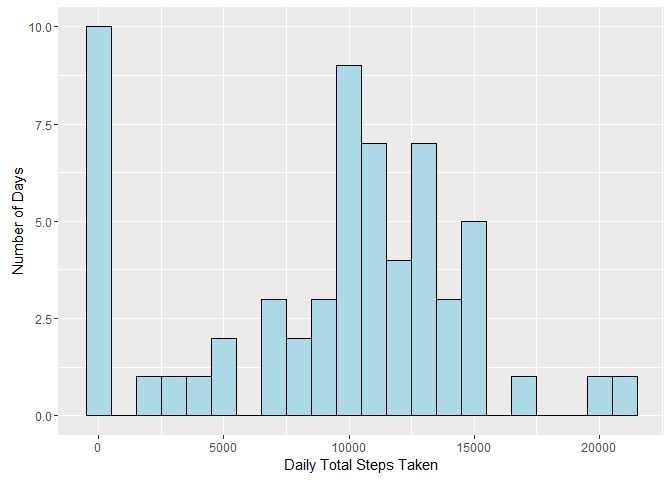
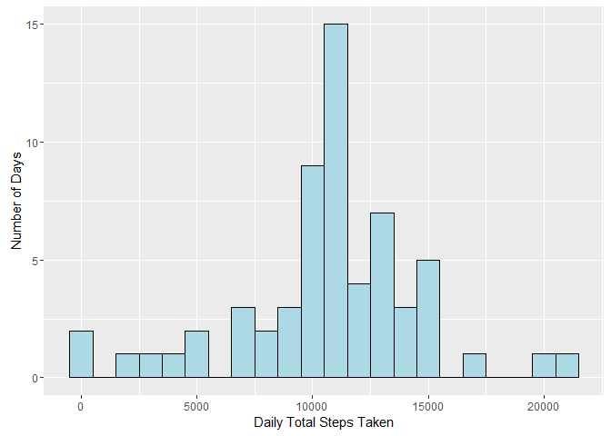
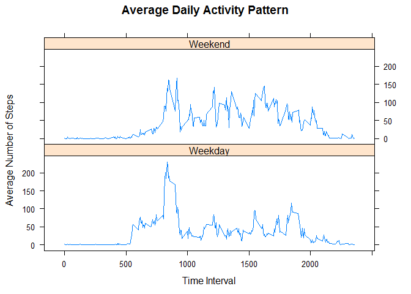

# Reproducible Research: Peer Assessment 1
**Introduction**  
This assignment makes use of data from a personal activity monitoring device.
This device collects data at 5 minute intervals throughout the day. The data
consists of two months of data from an anonymous individual collected during
the months of October and November, 2012 and include the number of steps
taken in 5 minute intervals each day.

**Source Data**  
Dataset: Activity monitoring data [52K]
Format: Comma-separated-value (CSV) file containing 17,568 observations
Variables:  
- steps: Number of steps taken per 5-minute interval (missing values are
coded as NA)  
- date: The date on which the measurement was taken in YYYY-MM-DD
format  
- interval: Identifier for the 5-minute interval in which measurement was
taken

## Loading and preprocessing the data

```r
# Load raw data into r
unzip("./activity.zip")
stepDat = read.csv("./activity.csv")
stepDat$date = as.Date(stepDat$date)
stepDat$steps = as.numeric(stepDat$steps)

# Format plot data by each of the 61 daily observations of the 288 5-minute intervals reported per day, adding the daily total and mean
library(reshape2)
library(dplyr)
wideDatd = dcast(stepDat, date ~ interval, value.var = "steps")
wideDatd = mutate(wideDatd,dayTotal=rowSums(wideDatd[,2:289],na.rm=TRUE),
            dayMean=rowMeans(wideDatd[,2:289],na.rm=TRUE))

# Format plot data by each of the 288 5-minute interval observations for the 61 days reported, adding the interval total and mean
wideDati = dcast(stepDat, interval ~ date, value.var = "steps")
wideDati = mutate(wideDati,intvlTotal=rowSums(wideDati[,2:62],na.rm=TRUE),
            intvlMean=rowMeans(wideDati[,2:62],na.rm=TRUE))
```


## What is mean total number of steps taken per day?


```r
# Make a histogram of the total number of steps taken each day
library(ggplot2)
p1 = ggplot(wideDatd, aes(wideDatd$dayTotal)) + 
    geom_histogram(color = "black", fill = "lightblue", binwidth = 1000) +
    labs(x = "Total Daily Steps Taken", y = "Number of Days")
print(p1)
```

<!-- -->

```r
meanSteps = as.integer(round(mean(wideDatd$dayTotal)))
medianSteps = as.integer(round(median(wideDatd$dayTotal)))
totalSteps = as.integer(round(sum(wideDatd$dayTotal)))
```

- Mean total steps per day 9354  
- Median total steps per day 10395  

## What is the average daily activity pattern?


```r
# Make a time series plot (i.e. type = "l") of the 5-minute interval (x-axis) and the average number of steps taken, averaged across all days (y-axis)
plotBreaks = c(0,500,1000,1500,2000)
p2 = ggplot(wideDati, aes(x=factor(interval,levels=ordered(interval)), y=intvlMean, group=1)) +
        geom_line() +
        xlab("Time Interval") + 
        ylab("Average Number of Steps") +
        ggtitle("Average Daily Activity Pattern") +
        scale_x_discrete(breaks=plotBreaks)
print(p2)
```

<!-- -->


```r
# Which 5-minute interval, on average across all the days in the dataset, contains the maximum number of steps?
intvlMax = filter(wideDati, intvlMean==(max(as.numeric((intvlMean)))))
```

Interval "835" is the 5-minute interval containing the maximum number of steps on average across all days, i.e., 206 steps.

## Inputing missing values


```r
# Calculate and report the total number of missing values in the dataset 
totalNA = sum(is.na(wideDatd[,2:289]))
```

The revised analysis below adjusts for the missing 2304 interval data instances (288 intervals/day for 8 days) by replacing each instance with its associated interval mean


```r
# Update the raw data by replacing the NAs with the calculated mean for each 5-minute interval
stepDat$steps = ifelse(is.na(stepDat$steps) == TRUE, as.integer(round(wideDati$intvlMean))[wideDati$interval %in% stepDat$interval], stepDat$steps)

# For each date in the raw dataset indicate whether it is a weekday or a weekend day
weekday = c("Monday", "Tuesday", "Wednesday", "Thursday", "Friday")
stepDat = mutate(stepDat,weekdaysInd=(weekdays(stepDat$date) %in% weekday))

# Rebuild the intermediate processing datasets

# Format plot data by each of the 61 daily observations of the 288 5-minute intervals reported per day, adding the daily total and mean
wideDatd = dcast(stepDat, date ~ interval, value.var = "steps")
wideDatd = mutate(wideDatd,dayTotal=rowSums(wideDatd[,2:289],na.rm=TRUE),
            dayMean=rowMeans(wideDatd[,2:289],na.rm=TRUE))

# Format plot data by each of the 288 5-minute interval observations for the 61 days reported, adding the interval total and mean split by weekday and weekend dates
wd = filter(stepDat,stepDat$weekdaysInd == TRUE) 
wd = dcast(wd, interval ~ date, value.var = "steps") 
wd = mutate(wd, weekdaysInd=TRUE, 
        intvlTotal=rowSums(wd[,2:ncol(wd)],na.rm=TRUE),
        intvlMean=rowMeans(wd[,2:ncol(wd)],na.rm=TRUE))
we = filter(stepDat,stepDat$weekdaysInd == FALSE) 
we = dcast(we, interval ~ date, value.var = "steps") 
we = mutate(we, weekdaysInd=FALSE, 
        intvlTotal=rowSums(we[,2:ncol(we)],na.rm=TRUE),
        intvlMean=rowMeans(we[,2:ncol(we)],na.rm=TRUE))
wideDati = rbind(wd[,c(1,47,49)],we[,c(1,18,20)])
wideDati$weekdaysInd = factor(wideDati$weekdaysInd,levels=c(TRUE,FALSE), labels=c("Weekday", "Weekend"))
```


```r
# Make a histogram of the total number of steps taken each day
p3 = ggplot(wideDatd, aes(wideDatd$dayTotal)) + 
    geom_histogram(color = "black", fill = "lightblue", binwidth = 1000) +
    labs(x = "Total Daily Steps Taken", y = "Number of Days")
print(p3)
```

<!-- -->

```r
# Calculate and report the mean and median total number of steps taken per day.
adjMeanSteps = as.integer(round(mean(wideDatd$dayTotal)))
adjMedianSteps = as.integer(round(median(wideDatd$dayTotal)))
adjTotalSteps = as.integer(round(sum(wideDatd$dayTotal)))

# Do these values differ from the estimates from the first part of the assignment?
diffMean = adjMeanSteps - meanSteps
diffMedian = adjMedianSteps - medianSteps

# What is the impact of imputing missing data on the estimates of the total daily number of steps?
difftotal = adjTotalSteps - totalSteps
```

**Comparison of the original versus adjusted results (Replaced 8 rows of NAs with mean level data)** 

**Total Steps:** Original (570608); Adjusted (656704);
Difference +86096    
**Mean:** Original (9354); Adjusted (10766);
Difference +1412    
**Median:** Original (10395); Adjusted (10762);
Difference +367

## Are there differences in activity patterns between weekdays and weekends?


```r
# Format plot data

# Generate time series panel plot
library(lattice)
xyplot(intvlMean ~ interval | weekdaysInd,
    data=wideDati[order(wideDati$interval),],
    main="Average Daily Activity Pattern",
    xlab="Time Interval",
    ylab="Average Number of Steps",
    type = "l",
    layout=c(1,2))
```

<!-- -->
